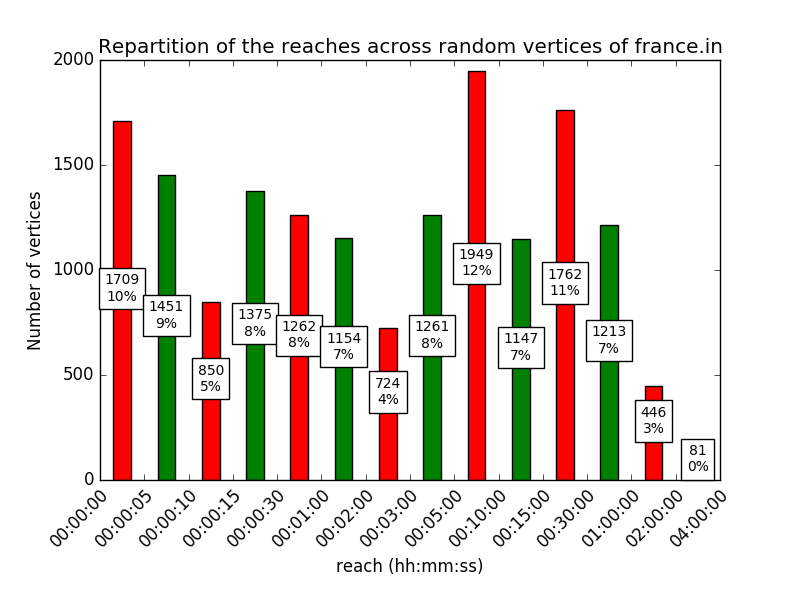
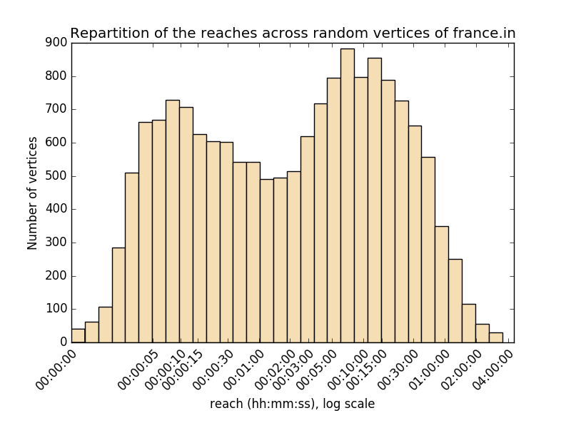

We provide the code along with several comments and implementation notes in the
`src/` folder.

Special implementations notes
=============================

For all the questions, our implementation gives the correct answer for multiple
shortest paths, aka when there are several paths of optimal length between two
points.

When we output point coordinates between two vertices, we make a mean of their
coordinates according to the distance between them (we suppose the edge is a
straight line and keep the same ratio).

First part
==========

For $(1.1)$ and $(1.2)$, using Dijkstra is obvious:

-   It is very efficient for shortest paths with single source (fastest
    algorithm we have heard of if implemented with Fibonacci heaps)

-   Because of the min-heap structure used, and the scanning of the vertices in
    the increasing order of distance, it is very simple to stop the execution as
    soon as we go further than the target distance, thus providing a faster
    algorithm.

For $(1.3)$, we can extend the algorithm by retaining the vertices at distance
$t_1$ and propagating them until we find a vertex at distance $t_2$, or stop as
soon as we go further.

If we consider multiple shortest paths, it leads to an inefficient memory usage
because we must propagate sets.

The elegant method was to first compute shortest paths using Dijkstra, then
select the vertices at distance greater than $t_2$ and backtrack until we are at
distance less than $t_1$.

Another advantage of this method is that it allows for

$$
t_2 < t_1
$$

And thus one can solve the original problem by setting

$$
t_2 = 0
$$

Optimisation tricks
-------------------

### Dijkstra stop

If our goal is the points at distance $t_2$, we can stop the Dijkstra for the
vertices at distance more than

$$
t_2 + \max\limits_{e \in E} e.length
$$

but we must be careful, if we allow $t_2 < t_1$, the condition becomes

$$
\max(t_1, t_2) + \max\limits_{e \in E} e.length
$$

### Dijkstra memoisation

Since Dijkstra represent a huge part of our computations, and it is basically
the same for all functions when we set one starting vertex in a graph, we can
compute the Dijkstra over the whole graph (about the same running time as
reading the input), and use it for other computations.

This part of the code has been replaced with the Online Dijkstra optimisation.

### Distance sorting

Because of memoisation, if we use small values of $t_1$ and $t_2$ (or close
ones), we actually lose time because we must test each vertex of the Dijkstra to
ensure it is at distance at least $t_2$, even if in the end we will never use
vertices whose distance to $v$ is not between *approximately* between $t_1$ and
$t_2$.

The solution is to return, along with the Dijkstra output, a list of all
computed vertices sorted by their distance.

Thus with binary search, we can find the first and last starting vertices that
are necessary for the backtrack, and iterate through the list.

This is a major optimisation for the part B for example, because we have to
answer numerous requests like $(1.2)$.

### Online Dijkstra

This optimisation is by far the most interesting, because a similar idea can be
used for the $B$ part.

The problem we have is that two major optimizations are incompatible: the
Dijkstra stop and the Dijkstra memoisation. If we stop the Dijkstra and then use
it with a greater stopping value, then it will be incorrect. Conversely, to
memoise the Dijkstra, we have to compute it over the whole graph, which is
really stupid for the country-sized one for example.

The answer to this is simple : return a value while not throwing away the
current computation step.

We implemented this in a very elegant fashion using Python's generators. We can
`yield` the current result from the generator, and conversely we can `send` the
new parameter value to the generator which is a less known feature of
generators.

Option B
========

We note `dist` the distance function.

`(B.1)`
-------

Suppose there is `v` with `r(v) > D/2`. Then there are $s$ and $t$ such that a
fastest path `s -> t` visits $v$, and `dist(s, v) >= r(v)` and `dist(v, t) >=
r(v)`. Then `dist(s, v) > D` which is a contradiction.

`(B.2)`
-------

Suppose there exists a point $s \in S_{in}$ and a point $t \in T_{out}$, such
that some quickest path from $s$ to $t$ passes through $v$. Let us show that
`dist(s, v) = 1 hour` and `dist(v, t) = 1 hour`. By symmetry of the definitions,
we only need to show it for `dist(s, v).` There exist a shortest path from s to
a vertex such that `v` is 1 hour away of s. But any subpath of a shortest path
is a shortest path (or else the main path is not the shortest). Thus `dist(s, v)
= 1 hour` and `dist(v, t) = 1 hour` and `r(v) >= 1 hour`.

`(B.3)`
-------

If the reach of `v` is at least `2 hours`, there are `s` and `t` such that a
fastest path `s -> t` visits `v`, and `dist(s, v) >= r(v) >= 2 hours` and
`dist(v,t) >= r(v) >= 2 hours`. Choose $t' \in T_{out}$ on the shortest path `v
-> t`extracted from `s -> t` and $s' \in S_{in}$ on the shortest path `s -> v`
extracted from `s -> t`. But any subpath of a shortest path is a shortest path
(or else the main path is not the shortest). Thus the path `s' -> t'` extracted
from `s -> t` is a shortest path that contains `v`.

`(B.4)`
-------

If we take the contrapositions of those propositions, if there are $s \in
S_{in}$ and $t \in T_{out}$ such that `dist(s, t) = dist(s, v) + dist(v, t)`,
then `r(v)` is more than `1 hour`. If those `s` and `t` do not exist, then
`r(v)` is less than `2 hours`.

We can model this with an oracle $O(r)$ such that : if $O(r)$ then$r(v) >= r$
else $r(v) < 2\times r$, where `r = 1 hour` in the previous example.

Conversely, the oracle has a defined behaviour only outside the interval $]r(v)
/ 2, r(v)]$ (left gives `True` and right gives `False`).

### 1. We find a factor 4 approximation

If we know a value $r$ such that $O(r/2) = True$ and $O(r) = False$, then we
know that $x$ is in $[r/2, 2\times r[$.

And for any starting point $y$, while $O(y) = True$ we multiply $y$ by 2 until
we have $O(y) = False$, and conversely for $O(y) = False$ to find such a value.

By the properties of the oracle, this terminates. We have a logarithmic
complexity. But when evaluating $O(y \times 2^k)$ for an integer k, we know that
there is an index that separates the `True` values from the `False` because of
the properties of the oracle. Thus we can apply binary search on this
logarithmic scale to have a $\log(\log(r(v)))$ number of evaluations of the
oracle.

### 2. We transform a $2^{1+\frac{1}{k}}$ approximation into a $2^{1+\frac{1}{2k}}$ approximation

Suppose you know $r(v)\in[a, b[$ with $\frac{b}{a} = 2^{1+\frac{1}{k}}$.

Take $c = a \times 2^\frac{1}{2k}$.

We know that if $r(v) \in [a, c[$, then $O(c)$ is false, and that if $r(v) \in
[2c, b[$, then $O(c)$ is true.

Thus we can eliminate one interval of ratio $2^\frac{1}{2k}$, and the remaining
interval is of ratio $2^{1+\frac{1}{k}-\frac{1}{2k}}$ = $2^{1+\frac{1}{2k}}$.

### 3. Complexity

We make $\log(\log(r(v)))$ calls to the oracle in the first stage, and then $i$
to get a $2^{1+\frac{1}{2^i}}$ approximation factor.

Since we work with integers, the stopping condition is $r(v) \times (2^{1 +
\frac{1}{2^i}} - 2) < 1$. A Taylor expansion gives us $i > \log(r(v)) + 1$ with
the first term, so $i > \log(r(v)) + 2$ should be sufficient.

### 4. Other strategies

Like shown below, more evaluations per step could get us immediately better
approximation factors than 2.

However, it requires too much evaluations, with no improvement in the worst
case, that is when the oracle is a threshold function.

Let $x_1, x_2 = \frac{r}{2}, x_3, x_4=b, x_5, x_6=2r$ be numbers in geometric
progression of ratio $\sqrt2$ with $r$ found after the first stage.

We know $O(x_2) = T, O(x_4) = F, O(x_6) = F$, and we know $x \in [x_2, x_6[$. We
split this interval in 4 and look at the values of $O(x_1), O(x_3), O(x_5)$. We
note $?$ when a value can be True or False.

For $r(v)\in[x_2,x_3[$, the possible values are $?, F, F$.

For $r(v)\in[x_3,x_4[$, the possible values are $T, ?, F$.

For $r(v)\in[x_4,x_5[$, the possible values are $T, ?, F$.

For $r(v)\in[x_5,x_6[$, the possible values are $T, T, ?$.

If we get $O(x_1) = F$ or $O(x_5) = T$, we know a $\sqrt2$ factor approximation
of $r(v)$. Else, the value of $x_3 = c$ allows us to eliminate either the
leftmost or the rightmost interval, which is exactly the first step of the
second stage of our general strategy to transform a $4 = 2^{1 + \frac{1}{1}}$
approximation into a $2\sqrt2 = 2^{1 + \frac{1}{2}}$ approximation.

### 5. Computation time of the oracle

Let's determine the computation time of the oracle :

We can memoize two Dijkstra results starting from `v` and following the normal
edges and the reversed edges. Thus we can compute quickly the two sets $S_{in}$
and $T_{out}$.

As we saw in the examples, the size of $S_{in}$ is not huge. Thus for each point
of $S_{in}$ we compute a Dijkstra, stopping when we know the distances to all
points of $T_{out}$. Finally we test `dist(s, t) = dist(s, v) + dist(v, t)` for
each `(s, t)` pair (`dist(s, v)` and `dist(v, t)` are known from the memoized
Dijkstra results).

### 6. Practical implementation and optimisations

As explained in `reach.py`:

>   A dichotomy for the 4-factor approximation

>   reduces the number of calls to the oracle

>   to $O(\log(\log(r)))$ for this stage.

>    

>   But it would also call it with bigger inputs

>   and more inputs that evaluate to False

>   thus taking a bit more time.

>    

>   If we are not lucky, it could call `oracle` with

>   a huge value, so it is not a good idea in practice

>   because `oracle` is optimised for small values.

Thus we did not implement the optimal 4-factor approximation.

For the Dijkstra between $S_{in}$ and $T_{out}$, we used the same method of
online algorithm with a specific function.

It leads to significant improvement because during the final steps of the
algorithm, there are a lot of elements in common between the $S_{in}$ sets.

We also clean the memory of those small Dijkstra at the end of each reach
computation (since they are only used by the oracle).

`(B.5)`
-------

We could notice a huge variance between the computation time of the `reach`
function for different vertices, positively correlated (but not proportional)
with the answer: for a bigger answer, we made more evaluations of the oracle,
and over bigger subgraphs.

Our program `compute_reach.py` can be launched from the command line. The bonus
is that multiple instances can be running at the same time, while updating the
same file of results and not wasting resources on the same starting vertex.

We also provide a small `launch.sh` bash script that launches multiple instances
of `compute_reach.py` in separate `screen` sessions and also logs the running
time.

`(B.6)`
-------

We used `launch.sh` to compute the `reach` of $2^{14}=16384$ vertices of the
`france.in` graph.

The results are available in CSV format in the `reach.log` file.

We computed two histograms, one as requested by the assignment, and one using a
logarithmic scale with a constant bin width chosen by the Freedman–Diaconis
rule[^1].

[^1]: <https://en.wikipedia.org/wiki/Freedman%E2%80%93Diaconis_rule>

Performances
============

Those are performances for `france.in`.

As we use Python 3, one could expect low performances, but they are quite good
thanks to all the optimisations.

We used PyPy3[^2] to speed up the computations.

[^2]: <http://pypy.org/>

The mean computation time of `reach` on a MacBook Pro Unibody 2012 is about
20-30 seconds per vertex, but many last less that 1 second, while some can last
over 10 minutes.

The drawback from the memoisation is the memory usage (and Python is
particularly not efficient unless you use `array.array`). After the graph is
loaded, Python uses `2.5GB` of memory, and after the converse graph is
generated, it uses almost `4GB`. If we delete the coordinates, we save about
`200MB`. But when it computes a huge value of `reach`, the memory usage can go
up to `10GB` (which is cleaned when we change of vertex). We could have saved
some memory by cleaning more the Dijkstra with targets (a simple heuristic would
clean the instances that have not been used by the last `k` calls to the oracle,
where `k` depends on the mean edge length on the graph and the current interval
in the `reach` function).

$\pagebreak$

Figures
=======

